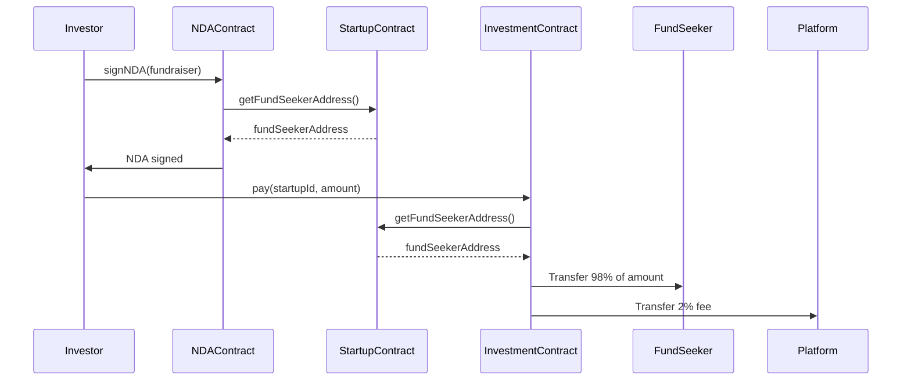

# decentralized-startup-ecosystem
A decentralized platform connecting startups with investors using smart contracts—featuring startup registration, secure funding, and NDA protection on the Hedera Network.
# Hedera Smart Contract Suite: Startup, Investment, and NDA Management

## 📌 Overview
This project is a suite of smart contracts deployed on the **Hedera Hashgraph** network, designed to facilitate startup fundraising with integrated NDA (Non-Disclosure Agreement) functionality. It consists of three main contracts:
1. **StartupContract**: Manages startup registration and fundraising goals.
2. **InvestmentContract**: Handles secure investments with a 2% platform fee.
3. **NDAContract**: Manages NDA agreements between investors and fundraisers.

---

## 🏗️ Smart Contracts

### 1. `StartupContract`
- **Purpose**: Register startups and manage their fundraising campaigns.
- **Key Functions**:
  - `registerStartup`: Registers a new startup with name, description, and funding goal.
  - `getFundSeekerAddress`: Retrieves the wallet address of a startup's fundraiser.
  - `getAllStartupIds`: Lists all registered startup IDs.

### 2. `InvestmentContract`
- **Purpose**: Securely process investments with a 2% platform fee.
- **Key Features**:
  - Transfers 98% of funds to the startup and 2% to the platform.
  - Validates startup existence before accepting payments.

### 3. `NDAContract`
- **Purpose**: Manage NDAs between investors and fundraisers.
- **Key Functions**:
  - `signNDA`: Allows investors to sign an NDA with a fundraiser.
  - `getNDAStatus`: Checks the NDA status for a given investor.

---

## 📂 Project Structure
```
├── contracts/
│   ├── InvestmentContract.sol
│   ├── NDAContract.sol
│   └── StartupContract.sol
├── scripts/
│   ├── Deployment/
│   │   ├── InvestmentContract-Hedera-deployment.js
│   │   ├── NDAContract-Hedera-deployment.js
│   │   └── StartupContract-Hedera-deployment.js
│   └── Function-Calls/
│       ├── Investment/
│       │   └── StartupContract-getFundSeekerAddress-function-call.js
│       ├── NDA/
│       │   └── NDAContract-getNDAStatus-function-call.js
│       └── Startup/
│           ├── StartupContract-getAll-function-call.js
│           ├── StartupContract-getProject-function-call.js
│           └── StartupContract-registerStartup-function-call.js
└── README.md
```

---

## 🛠️ Tech Stack
- **Blockchain**: Hedera Hashgraph (Testnet)
- **Smart Contracts**: Solidity (`^0.8.0`)
- **SDK**: `@hashgraph/sdk`
- **Utilities**: `dotenv`, `ethers.js`, `@hashgraph/hethers`

---

## ⚙️ Setup & Deployment

### Prerequisites
1. **Hedera Testnet Account**: Get your account ID and private key from the [Hedera Portal](https://portal.hedera.com/).
2. **Environment Variables**: Create a `.env` file:
   ```plaintext
   MY_ACCOUNT_ID=0.0.xxxx
   MY_PRIVATE_KEY=302e...
   ```

### Deployment Steps
1. **Compile Contracts**:
   ```bash
   solc --bin --abi contracts/*.sol -o build/
   ```
2. **Deploy Contracts**:
   ```bash
   node scripts/Deployment/StartupContract-Hedera-deployment.js
   node scripts/Deployment/InvestmentContract-Hedera-deployment.js
   node scripts/Deployment/NDAContract-Hedera-deployment.js
   ```

---

## 📜 Usage Examples

### 1. Register a Startup
```javascript
node scripts/Function-Calls/Startup/StartupContract-registerStartup-function-call.js
```
**Input**: Name, description, and funding goal.

### 2. Check NDA Status
```javascript
node scripts/Function-Calls/NDA/NDAContract-getNDAStatus-function-call.js
```
**Output**: List of NDAs signed by an investor.

### 3. Make an Investment
```javascript
node scripts/Function-Calls/Investment/StartupContract-getFundSeekerAddress-function-call.js
```
**Input**: Startup ID and investment amount.

---

## 📊 Flow Diagram


---

## 🤝 Contributing
1. Fork the repository.
2. Create a new branch (`git checkout -b feature/your-feature`).
3. Commit your changes (`git commit -am 'Add some feature'`).
4. Push to the branch (`git push origin feature/your-feature`).
5. Open a Pull Request.
